<div align="center">

# 🏠 Homiee

### Local Commerce Marketplace — Backend-Driven, Production-Deployed

**Full-stack local marketplace platform. ASP.NET Core 8 modular monolith · React 19 SPA · Azure Kubernetes Service · Real-time SignalR · AI-assisted image generation via Gemini.**

---

[](https://dotnet.microsoft.com/)
[](https://react.dev/)
[](https://www.microsoft.com/sql-server)
[](https://redis.io/)
[](https://kubernetes.io/)
[](https://github.com/features/actions)
[](https://azure.microsoft.com/)
[](LICENSE)

</div>

---

## 📖 Overview

Homiee solves the fragmentation problem for neighborhood-level commerce. Local sellers lack a digital storefront with ordering, analytics, and visibility. Customers lack a single surface to discover, evaluate, and purchase from nearby stores.

| Role | Capabilities |
|---|---|
| **Customer** | Discover stores/products, geospatial nearby search, cart & wishlist, COD checkout, order tracking, reviews, real-time chat |
| **Seller** | Onboard with business/identity verification, manage inventory, fulfil orders, view earnings & analytics, generate AI product images |
| **Admin** | Approve/suspend sellers, manage customers/categories, override orders, access platform KPIs |

Backend deployed on **Azure Kubernetes Service** with automated CI/CD. Frontend on **Vercel**.

---

## ✨ Key Features

| Area | Highlight |
|---|---|
| Auth | Email OTP verification · JWT with refresh rotation · logout revocation · Redis-cached revocation checks |
| Discovery | Paginated catalog · category/sort/filter · geospatial nearby search · weighted recommendation engine |
| Checkout | Multi-seller COD order in a single DB transaction · stock reduction · status history · post-commit notifications |
| Real-time | SignalR chat hub · push notification hub · WebSocket JWT token extraction |
| AI Image | Prompt validation → SHA-256 deduplication → Redis rate limit → Hangfire job → Gemini + Polly retry → Azure Blob |
| Analytics | Dapper-powered admin/seller KPI dashboards with Redis-cached results |
| DevOps | Docker → GitHub Actions CI/CD → ACR → AKS · cert-manager TLS · Kubernetes secrets/configmaps |
| Testing | xUnit · Moq · FluentAssertions · MVC Integration Testing · EF InMemory · Playwright E2E |

---

## 🛠️ Technology Stack

### Backend & Data

| Technology | Version | Purpose |
|---|---|---|
| ASP.NET Core Web API | .NET 8 | HTTP API, middleware, SignalR hubs, Swagger |
| Entity Framework Core | 8.0.0 | Primary ORM, migrations, transactional writes |
| Dapper | 2.1.72 | Analytics/reporting aggregate queries |
| SQL Server | 2022 | Primary relational database |
| Redis / StackExchange.Redis | 2.8.0 | Distributed cache, rate limiting, cooldown |
| Hangfire + SqlServer | 1.8.23 | Background job scheduling (AI, reminders) |
| SignalR | ASP.NET Core | Real-time chat and notifications |
| JWT Bearer + BCrypt | 8.0.0 / 4.1.0 | Auth tokens and password hashing |
| Polly | 8.6.6 | Retry policy for Gemini API calls |
| Azure Blob Storage | 12.27.0 | Images, seller proofs, AI-generated assets |
| Serilog | 8.x | Structured logging (console + file) |
| Sentry | 6.6.0 | Error monitoring and tracing |

### Frontend

| Technology | Version | Purpose |
|---|---|---|
| React + Vite | ^19.2.4 / ^8.0.4 | SPA framework and build tool |
| React Router | ^7.14.1 | Client routing and protected routes |
| TanStack React Query | ^5.99.0 | Server-state fetching and caching |
| Axios | ^1.15.0 | HTTP client with auth interceptors |
| SignalR Client | ^8.0.7 | Real-time hub connection |
| Leaflet / React Leaflet | ^1.9.4 / ^5.0.0 | Map picker and geolocation UI |
| Recharts + Framer Motion | ^3.8.1 / ^12.38.0 | Charts and animations |

### DevOps & Testing

| Technology | Purpose |
|---|---|
| Docker (multi-stage) + Docker Compose | Container build and local orchestration |
| Kubernetes · AKS · ACR | Production deployment manifests and registry |
| GitHub Actions | CI (build + test) and CD (ACR push + AKS rollout) |
| cert-manager / Let's Encrypt | Automated TLS provisioning on AKS ingress |
| Vercel | Frontend SPA deployment |
| xUnit · Moq · FluentAssertions | Unit and integration test stack |
| Playwright · coverlet | E2E browser tests and coverage collection |

---

## 🏗️ System Architecture

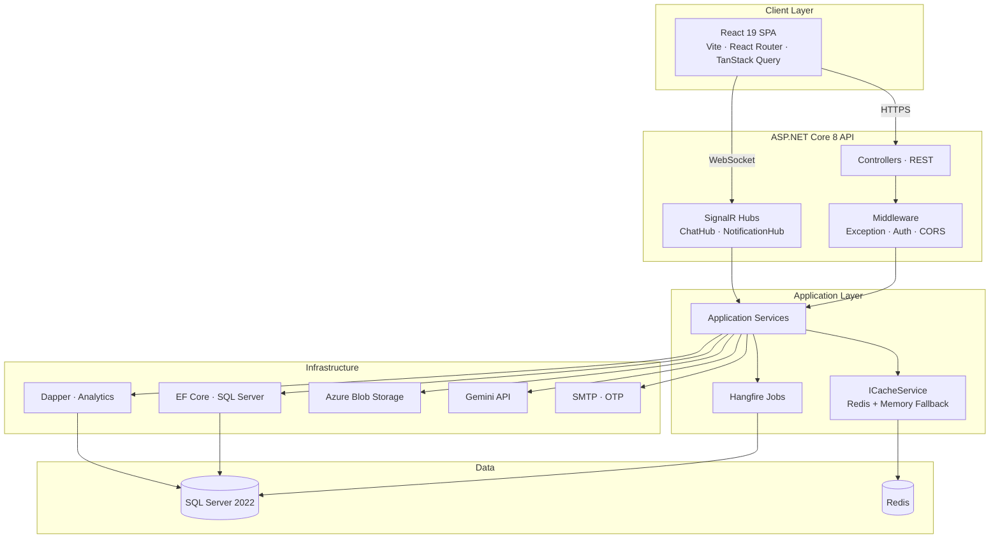

### Module Dependency Map

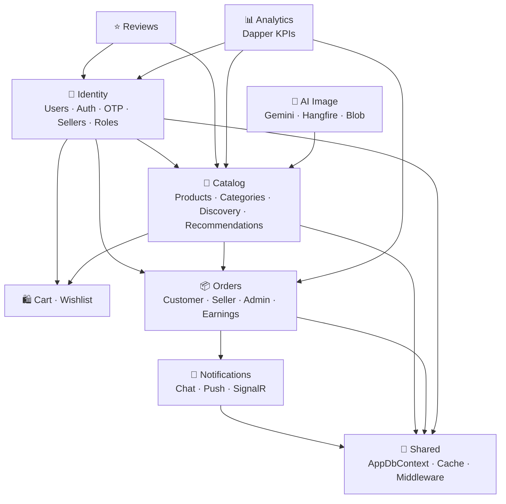

---

## 🗄️ Database Design

```mermaid
erDiagram
    User { int Id PK; string Email UK; string PasswordHash; string Role; bool IsBlocked; bool IsDeleted }
    Seller { int Id PK; int UserId FK; string BusinessName; string GstNumber; string Status; decimal Lat; decimal Lng; double Rating }
    Product { int Id PK; int SellerId FK; int CategoryId FK; string Name; decimal Price; int Stock; bool IsDeleted }
    ProductImage { int Id PK; int ProductId FK; string ImageUrl; bool IsPrimary }
    ProductVariant { int Id PK; int ProductId FK; string Label; decimal Price; int Stock; string SKU }
    Category { int Id PK; string Name; bool IsActive }
    Order { int Id PK; int UserId FK; int SellerId FK; string Status; decimal TotalAmount }
    OrderItem { int Id PK; int OrderId FK; int ProductId FK; int VariantId FK; int Qty; decimal UnitPrice }
    OrderStatusHistory { int Id PK; int OrderId FK; string Status; DateTime ChangedAt }
    Address { int Id PK; int UserId FK; string Line1; string City; string PinCode }
    Review { int Id PK; int UserId FK; int ProductId FK; int OrderId FK; int Rating }
    SellerReview { int Id PK; int UserId FK; int SellerId FK; int OrderId FK; int Rating }
    Notification { int Id PK; int UserId FK; string Message; bool IsRead }
    Wishlist { int Id PK; int UserId FK; int ProductId FK }
    ChatMessage { int Id PK; int SenderId FK; int ReceiverId FK; string Content; bool IsRead }
    SellerEarning { int Id PK; int SellerId FK; int OrderId FK; decimal Amount; string Status }
    AiGenerationRequest { int Id PK; int UserId FK; string PromptHash; string Status; string SelectedImageUrl; string HangfireJobId; int RetryCount }
    RefreshToken { int Id PK; int UserId FK; string Token UK; DateTime ExpiresAt; bool IsRevoked }
    OtpCode { int Id PK; int UserId FK; string Code; int AttemptCount; DateTime ExpiresAt; bool IsUsed }

    User ||--o{ Order : places
    User ||--o{ Review : writes
    User ||--o{ Wishlist : saves
    User ||--o{ Address : has
    User ||--o{ Notification : receives
    User ||--o{ ChatMessage : sends
    User ||--|| Seller : "is a"
    User ||--o{ RefreshToken : has
    User ||--o{ OtpCode : receives
    User ||--o{ AiGenerationRequest : submits
    Seller ||--o{ Product : owns
    Seller ||--o{ Order : fulfills
    Seller ||--o{ SellerEarning : earns
    Product ||--o{ ProductImage : has
    Product ||--o{ ProductVariant : has
    Product ||--o{ OrderItem : in
    Product ||--o{ Review : receives
    Category ||--o{ Product : contains
    Order ||--o{ OrderItem : contains
    Order ||--o{ OrderStatusHistory : tracks
    Order ||--|| SellerEarning : generates
```

> Full API endpoint reference → [`docs/api-reference.md`](docs/api-reference.md)

---

## 🔄 Core Business Flows

### Transactional COD Checkout

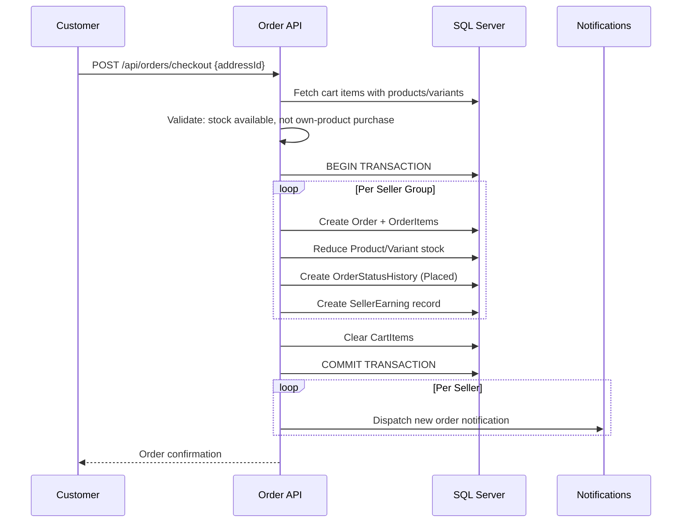

### AI Image Generation Flow

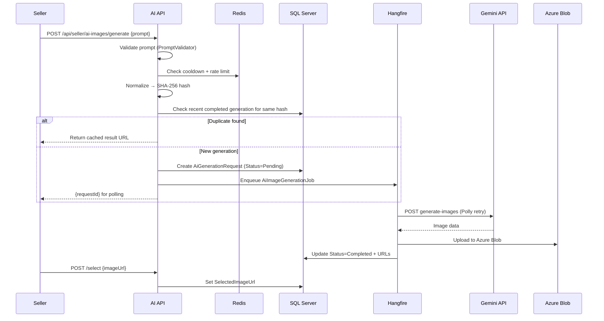

---

## 🔐 Security

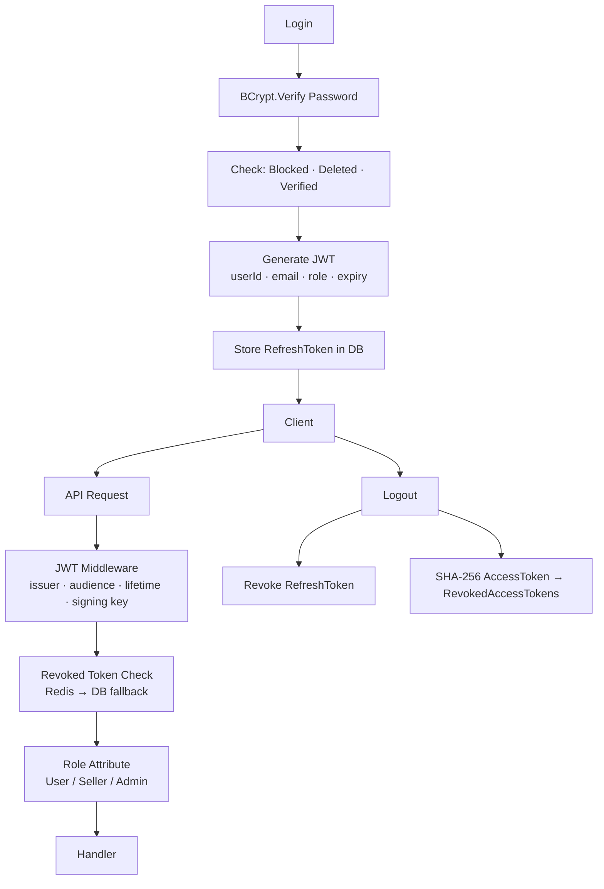

**Key controls:** BCrypt password hashing · JWT with full claim validation · refresh token rotation · logout revocation with Redis-cached negative lookups · OTP with attempt limits and 60s cooldown · role-based authorization on all protected endpoints · ownership checks at service layer · HTTPS redirect + cert-manager TLS · GitHub Actions secrets → Kubernetes Secrets in CD · soft deletes on users and products.

> Detailed security controls and known risks → [`docs/security.md`](docs/security.md)

---

## ⚡ Caching Strategy

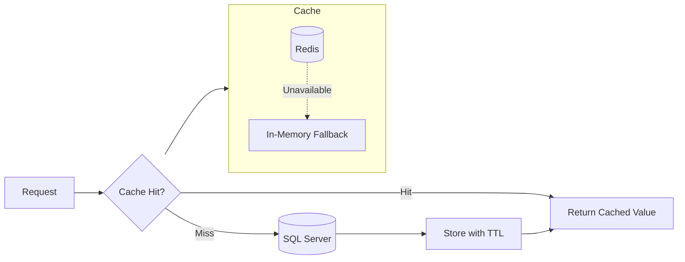

**Cache-aside applied to:** categories · product detail · seller detail · recommendations · analytics KPIs · cart/wishlist · revoked token lookups · AI rate limit and cooldown state. All TTLs are configurable via `appsettings.json`. If Redis is unavailable at startup, the app falls back to `IMemoryCache` transparently through the `ICacheService` abstraction.

---

## ⚙️ Background Processing

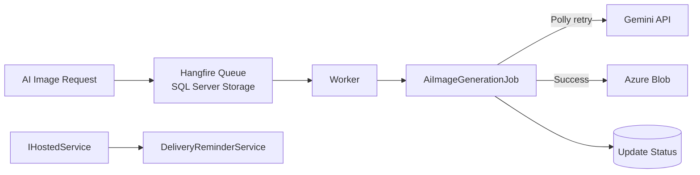

Hangfire uses the existing SQL Server instance — no additional message broker required. The dashboard is available at `/hangfire` in development.

---

## 📡 Observability & Monitoring

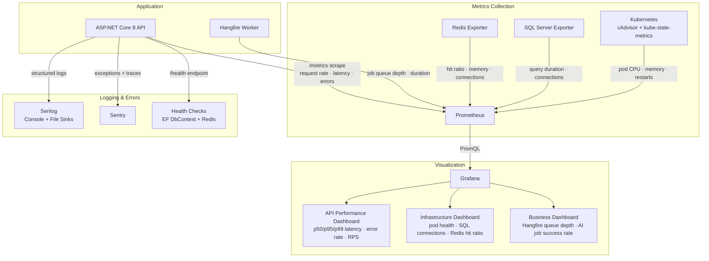

| Tool | Status | Purpose |
|---|---|---|
| Serilog | ✅ Implemented | Structured logging, console + file sinks |
| Sentry | ✅ Implemented | Exception capture, distributed tracing |
| Health Checks `/health` | ✅ Implemented | EF Core + Redis liveness |
| Prometheus + Grafana | 🔜 Planned | Metrics scraping, dashboards, alerting |
| OpenTelemetry | 🔜 Planned | Distributed trace propagation |
| Azure Monitor | 🔜 Planned | AKS cluster and node health |

---

## 🚀 DevOps & Deployment

### CI/CD Pipeline

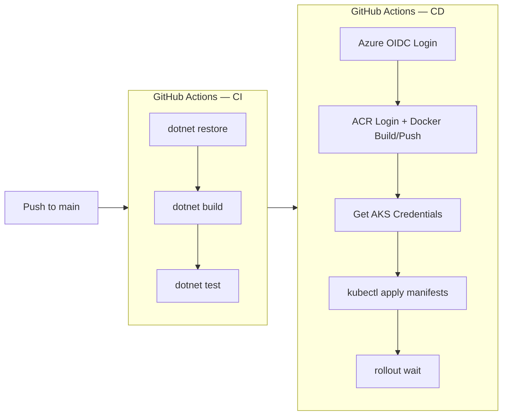

### Kubernetes Architecture (AKS)

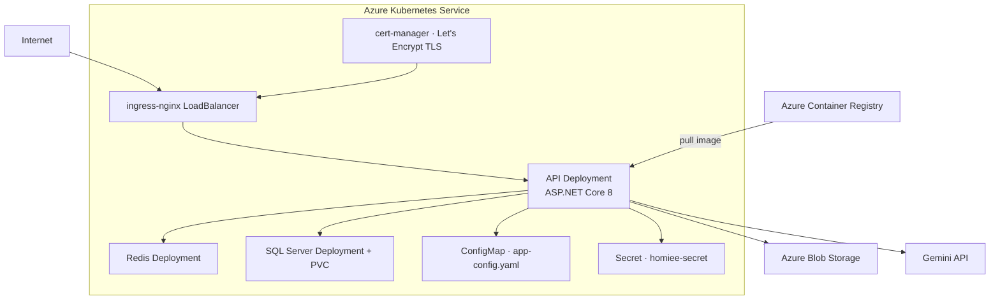

---

## 🧪 Testing

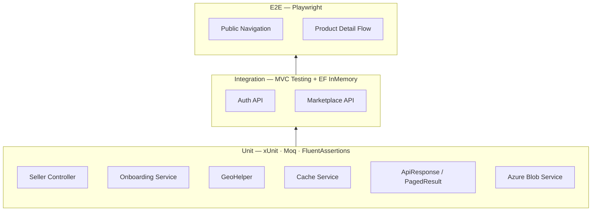

**35 tests total** — 30 passing. 5 integration tests failing due to `Program.cs` startup DB validation running before the `WebApplicationFactory` can replace the connection string. Fix: decompose the startup guard to be injection-friendly.

---

## 🏆 Engineering Highlights

**1. Transactional Multi-Seller Checkout** — Pre-transaction validation of all cart items, then a single DB transaction creating seller-grouped orders, reducing stock, inserting status history, creating earnings records, and clearing the cart. Notifications fire post-commit to avoid side effects inside the transaction.

**2. AI Image Generation Pipeline** — Six-layer control: prompt validation → SHA-256 normalized-prompt deduplication → Redis rate limit/cooldown → Hangfire async dispatch → Gemini call with Polly exponential retry → Azure Blob upload. Generation never blocks the HTTP thread; identical prompts return cached results.

**3. Two-Stage Geospatial Search** — Bounding box SQL pre-filter narrows candidates cheaply; Haversine distance calculation runs in-memory for exact results. Avoids full-table distance scans without requiring a geospatial index.

**4. Dual ORM Strategy** — EF Core for transactional CRUD and relationship navigation; Dapper for multi-table aggregate analytics queries. Separates OLAP from OLTP workloads cleanly within a single application.

**5. Revoked Token Negative Caching** — `RevokedAccessTokenRepository` caches both positive *and* negative lookups in Redis, eliminating DB round-trips on every authenticated request for non-revoked tokens.

**6. Graceful Cache Degradation** — `ICacheService` abstraction switches from Redis to `IMemoryCache` at startup if the Redis connection is unavailable. Cache failures never cascade to API failures.

---

## 📋 Resume Highlights

> Quick-scan section for recruiters and hiring managers

- **Architecture:** ASP.NET Core 8 modular monolith with Clean Architecture-inspired layering across 8 domain modules (Identity, Catalog, Cart, Orders, Reviews, Notifications, Analytics, AiImage)
- **Auth:** JWT + BCrypt + refresh token rotation + logout revocation + Redis-cached negative token lookups + OTP with attempt limits
- **Checkout:** Multi-seller transactional COD order — stock reduction, order history, earnings, cart clearing in one DB transaction
- **AI:** Gemini Imagen integration — prompt validation, SHA-256 deduplication, Redis rate limiting, Hangfire async, Polly retry, Azure Blob
- **Data:** EF Core 8 (OLTP) + Dapper (analytics read model) + SQL Server 2022 · 23+ DbSets, composite unique indexes, soft deletes
- **Caching:** Cache-aside with Redis + in-memory fallback across categories, products, sellers, recommendations, analytics, auth
- **Real-time:** SignalR chat and push notification hubs with WebSocket JWT token extraction
- **DevOps:** Docker multi-stage → GitHub Actions CI/CD → ACR → AKS → cert-manager TLS · Kubernetes configmaps + secrets
- **Testing:** xUnit + Moq + FluentAssertions (unit) · MVC Testing + EF InMemory (integration) · Playwright (E2E)
- **Observability:** Serilog structured logging · Sentry error monitoring · `/health` covering DB and Redis

---

## 💻 Local Development

**Prerequisites:** [.NET 8 SDK](https://dotnet.microsoft.com/download/dotnet/8) · [Docker Desktop](https://www.docker.com/products/docker-desktop/) · [Node.js 20+](https://nodejs.org/)

```bash
# 1. Clone and configure
git clone https://github.com/Suhailaslamk/Homiee.git && cd Homiee
cp .env.example .env
# Fill .env: JWT secret, SMTP, Azure Blob connection string, Gemini API key

# 2. Start API + SQL Server + Redis
docker compose up -d
# API:      http://localhost:8080
# Swagger:  http://localhost:8080/swagger
# Hangfire: http://localhost:8080/hangfire  (dev only)
# Health:   http://localhost:8080/health

# 3. Frontend
cd Homiee-Frontend && npm install && npm run dev
# App: http://localhost:5173

# 4. Tests
cd Homiee.Tests
dotnet test                                                      # all tests
dotnet test --collect:"XPlat Code Coverage"                      # with coverage
HOMIEE_E2E_BASE_URL=http://localhost:5173 dotnet test --filter "Category=E2E"  # E2E
```

---

## 🌐 Deployment

**Prerequisites:** Azure AKS cluster · Azure Container Registry · GitHub secrets configured (`AZURE_CLIENT_ID`, `AZURE_TENANT_ID`, `AZURE_SUBSCRIPTION_ID`, `ACR_LOGIN_SERVER`, `AKS_RESOURCE_GROUP`, `AKS_CLUSTER_NAME` + app secrets)

```bash
# Automated — push to main triggers full CI/CD pipeline (see .github/workflows/)

# Manual apply
kubectl create secret generic homiee-secret \
  --from-literal=ConnectionStrings__DefaultConnection="..." \
  --from-literal=Jwt__Key="..."
  # ... remaining secrets

kubectl apply -f k8s/
kubectl rollout status deployment/homiee-api

# Frontend — connect Homiee-Frontend/ to Vercel; vercel.json includes SPA rewrite rules
```

---

## 📁 Project Structure

```
Homiee/
├── .github/workflows/          # ci.yml (build+test) · cd.yml (ACR+AKS deploy)
├── Homiee/                     # ASP.NET Core 8 API
│   ├── Modules/
│   │   ├── Identity/           # Auth · Users · Sellers · OTP · Roles
│   │   ├── Catalog/            # Products · Categories · Discovery · Recommendations
│   │   ├── Cart/               # CartItems · Wishlist
│   │   ├── Orders/             # Customer · Seller · Admin · Earnings · History
│   │   ├── Reviews/            # Product and seller reviews
│   │   ├── Notifications/      # Chat · Push · SignalR hubs
│   │   ├── Analytics/          # Admin/seller Dapper KPI dashboards
│   │   └── AiImage/            # Gemini · Hangfire job · rate limit · Blob
│   ├── Shared/                 # AppDbContext · ICacheService · Middleware · ApiResponse
│   ├── Migrations/             # EF Core migrations
│   ├── Program.cs              # Bootstrap · DI · auth · Swagger · health
│   └── Dockerfile              # Multi-stage build
├── Homiee.Tests/
│   ├── Unit/                   # xUnit · Moq · FluentAssertions
│   ├── Integration/            # MVC Testing · EF InMemory
│   └── E2E/                    # Playwright browser tests
├── Homiee-Frontend/            # React 19 SPA
│   ├── src/api/                # Axios instance + auth interceptors
│   ├── src/hooks/              # useSignalR · custom hooks
│   ├── src/pages/              # Admin · Seller · Customer route trees
│   ├── App.jsx                 # Route config + protected routes
│   └── vercel.json             # SPA rewrite rules
├── k8s/                        # api · redis · sql deployments · ingress · cert-manager
├── docker-compose.yml          # Local: API + SQL Server + Redis
└── docs/
    ├── api-reference.md        # Full endpoint tables
    └── security.md             # Security controls and risk register
```

---

## 🏛️ Architecture Decisions

- **Modular monolith over microservices** — simpler deployment, single-transaction checkout, module boundaries extractable if scale demands it.
- **EF Core + Dapper** — EF for transactional CRUD; Dapper for analytics aggregates where entity materialization is wasteful. Right tool per workload.
- **Redis with memory fallback** — shared cache across replicas; `ICacheService` abstraction degrades to `IMemoryCache` silently if Redis is unavailable.
- **Hangfire over a message broker** — Gemini calls are async and retriable; Hangfire reuses SQL Server storage and adds a dashboard without another infrastructure dependency.
- **SignalR** — abstracts WebSocket/SSE/Long-Polling; Microsoft client SDK integrates cleanly with the React frontend.

---

## 📄 License

[MIT](LICENSE) · Built by [Suhail Aslam](https://github.com/Suhailaslamk)